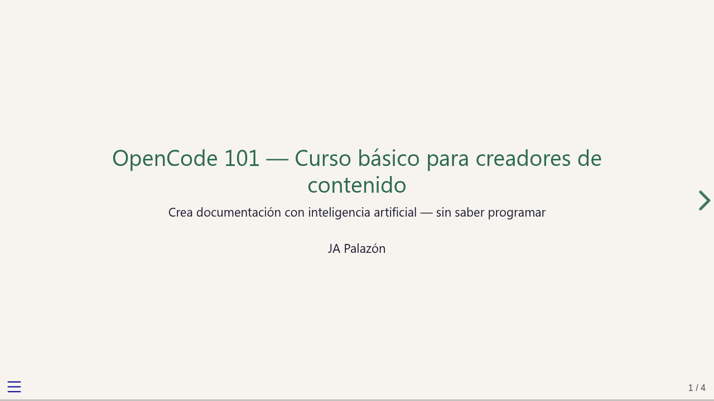

# OpenCode 101 — Curso básico para creadores de contenido

<p align="center">
  <a href="https://palazon.github.io/ocCursoIntro/presentacionCursoOC101.html">
    
  </a>
</p>

Curso práctico de **12 pasos** para aprender a usar
[OpenCode](https://opencode.ai) como asistente de IA en tareas de
documentación técnica, redacción de informes, material educativo e
investigación. Sin necesidad de saber programar.

Si quieres una descripción breve pero con más detalles puedes
consultar el *resumen del curso*
([HTML](https://palazon.github.io/ocCursoIntro/oc101.html) |
[PDF](https://palazon.github.io/ocCursoIntro/oc101.pdf)).

## ¿Para quién es este curso?

Dirigido a **docentes, formadores, redactores técnicos y cualquier
profesional** que quiera usar inteligencia artificial para crear y
mantener documentación: manuales, guías, informes, FAQs, actas,
cuestionarios y plantillas.

El curso es **autónomo**: puedes seguirlo a tu ritmo, sin instructor. Si en algún ejercicio te atascas, puedes pedir ayuda a cualquier chatbot (ChatGPT, Claude, Gemini, etc.) o al propio OpenCode una vez lo tengas instalado.

## Estructura del curso

El curso se organiza en pasos, cada uno aborda un tema concreto, deben seguirse secuencialmente para llegar al mejor resultado.

| Bloque | Pasos | Contenido |
|--------|-------|-----------|
| I — Fundamentos | 0 – 3 | Concepto, sistema de archivos, instalación, primeros diálogos |
| II — El taller de documentos | 4 – 8 | Contenido externo, investigación web, reestructuración, traducción, tablas |
| III — Productividad y cierre | 9 – 11 | Comandos personalizados, revisión asistida, entrega final |

Incluye además una página de [**ideas y ejemplos**](https://palazon.github.io/ocCursoIntro/ideas101.html)
para empresa, academia, deportes, hogar y aficiones, y unas
[**preguntas frecuentes**](https://palazon.github.io/ocCursoIntro/faq.html)
para resolver dudas habituales.

> **Curso para avanzar:** [OpenCode 102 — Automatización y personalización](https://github.com/palazon/ocCursoAvanzado)
> 7 pasos para crear agentes a medida, skills reutilizables, Git, MCP, CLI, permisos y colaboración en equipo.

## Cómo empezar

### A. *On line* (recomendado)

Solo necesitas un navegador. Abre
[**este enlace**](https://palazon.github.io/ocCursoIntro/index.html) y sigue el curso
sin descargar ni instalar ningún fichero del curso.

### B. Desde la distribución local (para curiosos inquietos)

Descarga [cursoIntroOpenCode.zip](cursoIntroOpenCode.zip), descomprime y abre
`cursoIntroOpenCode/index.html` en tu navegador. Todo está listo para
seguir los ejercicios con OpenCode abierto a su lado.

### C. Desde los fuentes (avanzado, para usuarios de Git)

Clona el repositorio. Los archivos `.qmd` (formato Quarto) están en
`contenidos/`. Para regenerar los HTML:

```bash
bash render-all.sh
```

## Requisitos

Para seguir el curso necesitas:

- OpenCode instalado — se explica en el Paso 2
- Cuenta gratuita de OpenCode Zen (activada por defecto)
- Navegador web para ver los HTML

Opcionalmente:

No son necesarios y pueden instalarse posteriormente:

- Quarto (solo cuando vayas a modificar fuentes)
- `git` (solo si quieres clonar el repositorio)

---

## ¿Encontraste un error o tienes una sugerencia?

Abre un [issue en GitHub](https://github.com/palazon/ocCursoIntro/issues).

---

## Agradecimientos

A **jesusda**, por presentarme OpenCode.  
A **Pedro**, mi hermano, por su constante retroalimentación sobre el curso.

---

*Curso OpenCode 101 · Idea original de JA Palazón · Mayo 2026*
