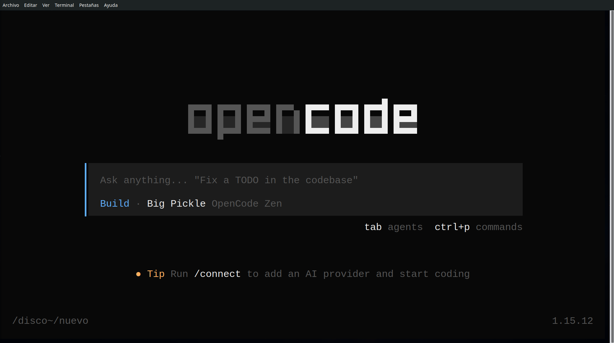

## Objetivo

Instalar OpenCode, abrirlo por primera vez, conocer la interfaz básica
y crear tu primer documento usando los modos Plan y Build.

Duración estimada: **30 minutos**

---

## Instalación en Windows

El método recomendado para usar OpenCode en Windows es a través de
**WSL2** (Windows Subsystem for Linux). WSL2 te permite ejecutar un
entorno Linux dentro de Windows de forma fluida.

### 1. Instalar WSL2

Abre **PowerShell como administrador** y ejecuta:

```powershell
wsl --install
```

Esto instala WSL2 con una distribución Ubuntu por defecto. Una vez
terminado, reinicia el equipo si se te pide.

> Si quieres más detalles, Microsoft tiene una
> [guía oficial de instalación de WSL](https://learn.microsoft.com/es-es/windows/wsl/install).

### 2. Abrir WSL y actualizar paquetes

Abre "Ubuntu" desde el menú de inicio. Se abrirá una terminal Linux.
La primera vez te pedirá crear un usuario y contraseña.

Dentro de WSL, actualiza los paquetes:

```bash
sudo apt update && sudo apt upgrade -y
```

### 3. Instalar OpenCode

Ejecuta el instalador oficial:

```bash
curl -fsSL https://opencode.ai/install | bash
```

Al terminar, cierra y vuelve a abrir la terminal WSL, o ejecuta:

```bash
source ~/.bashrc
```

### 4. Verificar la instalación

```bash
opencode --version
```

Deberías ver un número de versión. Si es así, OpenCode está listo.

---

## Otros sistemas

| Sistema | Comando |
|---------|---------|
| **macOS** | `brew install anomalyco/tap/opencode` |
| **Linux** | `curl -fsSL https://opencode.ai/install \| bash` |
| **Windows (nativo)** | `npm install -g opencode-ai` o `choco install opencode` |

Para más detalles, visita la
[documentación oficial de instalación](https://opencode.ai/docs/#install).

---

## Conocer la interfaz (TUI)

Desde la terminal WSL, navega hasta la carpeta donde quieras trabajar
y ejecuta:

```bash
opencode
```

Verás una pantalla dividida en dos áreas:



- **Área superior:** respuestas y acciones del asistente
- **Área inferior (chat):** donde tú escribes los mensajes
- **Esquina inferior derecha:** indicador del modo activo (Build o Plan)

Pulsa  para alternar entre los dos modos. Observa cómo cambia
el indicador.

Escribe `/help` para ver los comandos disponibles.

---

## Entrar, salir y continuar una sesión

- **Entrar:** `opencode` desde la terminal
- **Salir:** escribe `/exit` o pulsa **Ctrl+C**
- **Sesiones:** cada vez que abres OpenCode empiezas una sesión nueva.
  Los archivos que crees se guardan en tu disco, pero el historial de
  la conversación no se conserva entre sesiones. Si quieres guardar
  una conversación, usa `/share` para compartirla.

Para este curso trabajaremos siempre en la misma carpeta del proyecto.

---

## Manos a la obra

Vas a crear tu primer documento usando los dos modos de OpenCode:
primero **Plan** para diseñar el contenido, luego **Build** para
generar el archivo.

> ⚠️ **Antes de empezar:** mira la esquina inferior derecha de la
> pantalla. Allí pone **Build** o **Plan**. Usa  para
> cambiar. Asegúrate de estar en el modo correcto antes de cada ejercicio.

### Ejercicio 1 — Plan mode

> **Modo:**  `Plan` — pulsa Tab para estar en modo Plan

Escribe lo siguiente en el chat:

> Soy profesor de secundaria. Necesito crear un documento que explique
> los fundamentos de la teoría de la evolución de Darwin para
> estudiantes de 14-15 años. Hazme un plan con los apartados que
> debería incluir y qué contenido pondrías en cada uno.

OpenCode te responderá con una estructura de apartados. Puedes pedirle
cambios si quieres, por ejemplo:

> Añade un apartado sobre ejemplos cotidianos de la evolución.

### Ejercicio 2 — Build mode

> **Modo:**  `Build` — pulsa Tab para estar en modo Build

Ahora escribe:

> Perfecto. Ahora genera el documento completo en un archivo llamado
> darwin-evolucion.md. Lenguaje sencillo, tono divulgativo, ejemplos
> claros. Quiero que esté listo para imprimirlo y dárselo a la clase.

OpenCode creará el archivo en tu carpeta. Puedes comprobarlo de
dos formas:

**Fuera de OpenCode** — abre otra terminal y escribe:

```bash
cat darwin-evolucion.md
```

**Sin salir de OpenCode** — escribe en el chat:

> `!cat darwin-evolucion.md`

El signo `!` le dice a OpenCode que ejecute ese comando en la
terminal sin cerrar la sesión. Útil para comprobaciones rápidas.

### Ejercicio 3 — Añadir un cuestionario

Sin cerrar la sesión, escribe:

> Ahora añade al final del archivo un cuestionario de 5 preguntas tipo
> test sobre el contenido. Cada pregunta con 4 opciones. Incluye las
> respuestas correctas al final del todo.

OpenCode **editará el archivo existente** para añadir el cuestionario,
sin tener que empezar de cero.

### Ejercicio 4 — Convertir a Word (opcional)

> ¿Tienes Word y quieres un .docx? Pídeselo a OpenCode (necesita la
> librería python-docx, pero OpenCode la instalará automáticamente):

> Convierte darwin-evolucion.md a un archivo .docx usando python-docx.

---

::: {.callout-note}
## ¿Por qué Markdown?

OpenCode trabaja de forma nativa con **Markdown (.md)**: es texto
plano, ligero, se versiona bien con Git y herramientas como Quarto lo
convierten a HTML, PDF o Word. Al usar `.md` evitas formatos binarios
(.docx) que OpenCode no puede leer ni modificar directamente.
:::

::: {.callout-note}
## ¿HTML mejor que DOC?

Para visualizar el material generado, suele ser más rápido convertir
el `.md` a HTML que a .docx. HTML se abre al instante en cualquier
navegador, no requiere Word, y respeta fielmente el formato. Con
Quarto es tan sencillo como `quarto render archivo.md`.
:::

---

## Resumen del paso

- ✅ OpenCode instalado y funcionando en Windows
- ✅ Conoces la interfaz: chat, modos, comandos básicos
- ✅ Sabes entrar, salir y cambiar entre Plan y Build
- ✅ Has creado un documento completo con Plan + Build
- ✅ Has ampliado el documento con un cuestionario
- ✅ Entiendes por qué Markdown es el formato ideal con OpenCode

En el próximo paso profundizaremos en la interfaz y en cómo
referenciar archivos con `@`.

*Curso OpenCode 101 · Idea original de JA Palazón · Mayo 2026*
